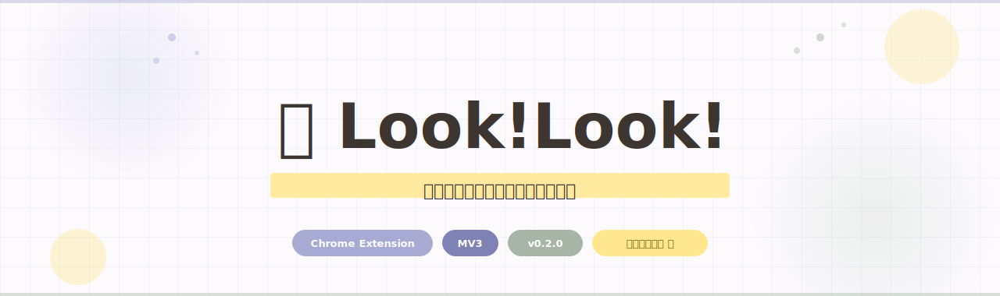

<div align="center">

<br>



<br>

## 👀 写真付きの導入ガイドはこちら 🔻

[](https://looklook-pages.pages.dev)

<br>

矢印で示して、丸で囲んで、クリックを光らせて、ズームして、ステップを重ねる。<br>
デモ・解説・チュートリアルのための Chrome 拡張機能。

<br>


<br>

</div>

---

## ✨ できること

### 🖊️ 描く・囲む・伝える

| ツール | 説明 |
|--------|------|
| ↖ ポインター | 通常カーソルモード |
| ✋ 移動ツール | 配置した注釈・スタンプをドラッグで移動 |
| □ 四角 | 範囲を四角で囲む |
| ○ 丸 | 重要な箇所を丸で強調 |
| ↗ 矢印 | 注目ポイントを矢印で指し示す |
| ✏️ ペン | フリーハンドで自由に描き込む |
| T テキスト | 画面の好きな場所に文字を直接入力 |
| 🫥 モザイク | 個人情報・機密データをドラッグで隠す |
| ① ステップ番号 | クリックでポンポン番号バッジを置ける |

### 🎭 魅せる演出

| 機能 | 説明 |
|------|------|
| ✨ ピコーン | クリック場所に光のバーストエフェクト |
| 🔍 ズームイン | 押している間、その場所に向かって画面全体がズームイン |
| 🔦 スポットライト | マウス周辺を照らして周囲を暗くする集中演出 |
| ⌨️ キーストローク | 押したキーが画面にリアルタイム表示 |

### 🎨 カスタマイズ

| 機能 | 説明 |
|------|------|
| 💬 スタンプ | 「重要」「OK」などのスタンプをワンクリック配置 |
| 😀 絵文字 | 絵文字を画面上に自由に貼れる |
| 🎨 カラー | プリセット色 + カスタムカラー + スポイト + 線の太さ調整 |
| 🌈 UIテーマ | 5種類（ナチュラル / ダーク / ピンク / ブルー / ブラック） |

---

## ⌨️ ショートカット

| 操作 | Mac | Windows |
|------|-----|---------|
| ツールバー ON / OFF | `⌘ Shift Y` | `Ctrl Shift Y` |

---

## 🚀 インストール方法

### Chrome デベロッパーモードで読み込む

```
1. このリポジトリをクローン or ZIPでダウンロード
2. Chrome で chrome://extensions を開く
3. 右上の「デベロッパーモード」をONにする
4. 「パッケージ化されていない拡張機能を読み込む」をクリック
5. このフォルダを選択
```

### ファイル構成

```
look-look-extension/
├── manifest.json
├── content.js          # メインのオーバーレイUI
├── background.js       # サービスワーカー
├── popup.html/js/css   # 拡張機能アイコンのポップアップ
├── settings.html/js/css # 設定画面
├── icons/
└── lib/
    ├── palette.js      # カラーパレット定義
    ├── stamps.js       # スタンプ・絵文字定義
    └── storage.js      # 設定の永続化
```

---

## 🌈 UIテーマ プレビュー

| 🌿 ナチュラル | 🌙 ダーク | 🌸 ピンク | 💙 ブルー | 🖤 ブラック |
|:---:|:---:|:---:|:---:|:---:|
| `#A6B5A5` | `#4A90E2` | `#E91E63` | `#1E88E5` | `#FFD600` |

テーマはページをまたいで記憶されます（`localStorage` + `chrome.storage.local`）。

---

## 🛠️ 技術仕様

- **Manifest V3**（Chrome Extension 最新仕様）
- **Shadow DOM** でページのスタイルを汚染しない設計
- `chrome.storage.local` で設定を永続化
- ツールバーはドラッグで位置を自由に変更可能

---

## 📄 ライセンス

MIT License

---

<div align="center">

**👀 Look!Look!** — 画面解説の、やさしいパートナー

</div>
